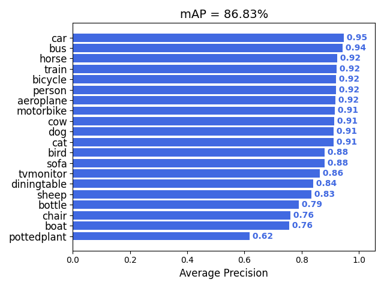

# YOLO v3

Since we cannot upload large files to GitHub, we leave some large images, the VOC dataset, and the trained models out. And you can download it in our releases. And the structure of this repo is the full version of the repo (no the one you see here). And you can just add these files to where it should exist in.

The changes are:

Add images to folder img.

Add `best_model_yolo.pth` to folder model_data.

Modify `model_path` setting in yolo.py.

Add the unziped VOC dataset to VOCdevkit (not provided).

## The Structure of this Repo
```
├── README.md
├── VOCdevkit: to put the VOC dataset in.
├── get_map.py
├── img: image for prediction.
│   ├── bus.jpg
│   ├── bus_predict.jpg
│   ├── cat.jpg
│   ├── cat_predict.jpg
│   ├── midway.jpg
│   └── midway_predict.jpg
├── logs: logs
│   └── best_epoch_weights.pth
├── model_data: store the model data, and dataset classes.
│   ├── simhei.ttf
│   ├── voc_classes.txt
│   └── yolo_anchors.txt
├── nets
│   ├── __init__.py
│   ├── classifier.py
│   ├── frcnn.py
│   ├── frcnn_training.py
│   ├── resnet50.py
│   ├── rpn.py
│   └── vgg16.py
├── predict.py
├── summary.py
├── train.py: run this to train the model.
├── utils
│   ├── __init__.py
│   ├── callbacks.py
│   ├── dataloader.py
│   ├── utils.py
│   ├── utils_bbox.py
│   ├── utils_fit.py
│   └── utils_map.py
├── voc_annotation.py: run this script first.
└── yolo.py
```

## Training and Predicting Process
1. Since we cannot upload the VOC dataset into Github, so before training, you need to download the VOC dataset and unzip it to folder VOCdevkit.

2. Run voc_annotation.py to generate 2007_train.txt and 2007_val.txt.

3. Run train.py to start training.

4. To predict the new image, change the model_path to the model path, and classes_path to the classes path in file yolo.py. After that, run predict.py and enter the image path to get the prediction. The image after prediction is saved in the same folder as the input image.

## Result

| model   | backbone   | dataset  | mAP0.5 |
| ------- | ---------- | -------- | ------ |
| YOLO v3 | Darknet-53 | VOC 2007 | 86.83% |



